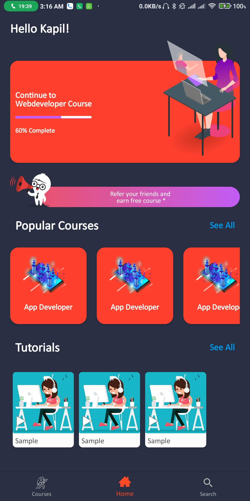
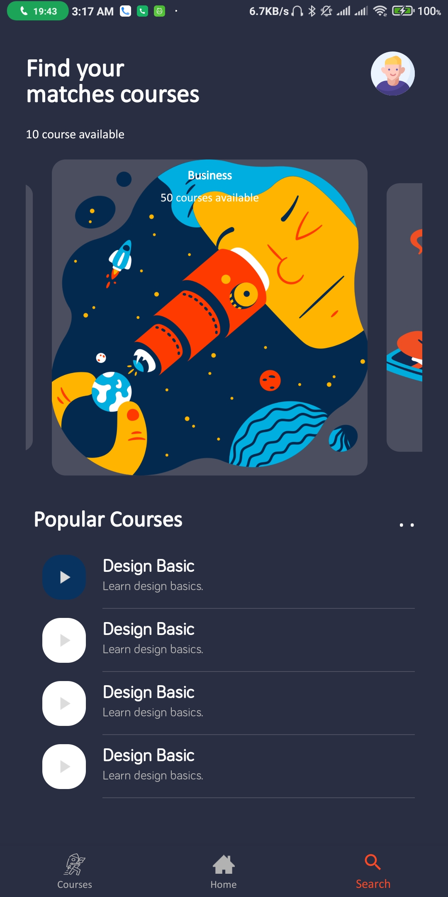

# EDUCyber complimintary app

This app is based on a UI Designing course due to time limitations and the lack of knowoledge we got inspired by the course to build the app.

Android Education App adding Design Course App UI

Original design credits https://dribbble.com/shots/6482664-Design-Course-App-UI
 
  
  ## Libraries used

This module use the following libraries:

- [Androidx](https://developer.android.com/jetpack/androidx)
- [ViewPager2](https://developer.android.com/jetpack/androidx/releases/viewpager2)
- [LiveData](https://developer.android.com/topic/libraries/architecture/livedata)
- [Navigation](https://developer.android.com/guide/navigation)
- [ViewBinding](https://developer.android.com/topic/libraries/view-binding)
- [Google Material Design](https://material.io/develop/android/docs/getting-started)

- **Images**
	- Glide 
	- Circleimageview

  
 ## 📸 Screenshots

**Click the image below to enlarge.**

<table>
  <tr>
     <td></td>
     <td></td>
     <td></td>
  </tr>
  <tr>
    <td></td>
    <td></td>
    <td></td>
  </tr>
 </table>

